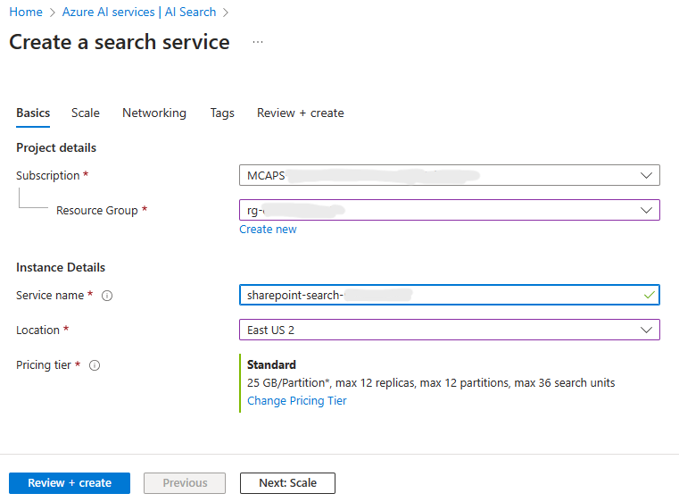

# Building a GenAI Knowledgebase from Files in SharePoint Online

## Prerequisites
In order to contain all Python dependencies and avoid conflicts, it is highly recommended you use a conda environment or any other mechanism for an isolated virtual environment. You can download/install miniconda [here](https://docs.anaconda.com/free/miniconda/miniconda-install/).

Create a new environment using the configuration provided:
```bash
conda env create -f environment.yml
```

## Configuring your App
All the configuration values that you'll use will be contained within a **.env** file. Copy the **.env.sample** file and rename it to `.env`. Then, open the file and paste the values for the environmental variables as you follow the rest of this doc.

### Create an Azure OpenAI Resource
You'll first need to have OpenAI service made available to your organization/subscription. If that is already done, create a [new Azure OpenAI resource](https://portal.azure.com/?microsoft_azure_marketplace_ItemHideKey=microsoft_openai_tip#create/Microsoft.CognitiveServicesOpenAI).

Select your subscription and create a new resource group. Give the resource group a unique name. For region, select one that is closest to you, but note that some regions are more heavily utilized than others and that can hinder performance or the service can return an error that it's received too many requests at the time. Also give your Azure OpenAI resource itself a unique name. Select a pricing tier that works for you, then click **Review + create**.


With the resource created, it will forward you to the overview page for your new Azure OpenAI resource. Click the **Keys and Endpoint** tab in the left navigation pane. Copy the value for **KEY 1** and paste it into the **.env** file in between the quotes for the variable **AZ_OAI_API_KEY**. Copy and paste the **Endpoint** URL into the variable **AZ_OAI_ENDPOINT**.

#### Creating and Deploying OpenAI Models
With the resources created, you'll next need to deploy two different models. One to generate the vectorized embeddings that will be stored in Azure AI Search indexes and the other that will perform the human chat completions.

From the Azure OpenAI resource page, click the **Model deployments** tab in the left navigation (might require you to go to Azure OpenAI Studio). From there, click the **Create new deployment** button and select the `text-embedding-ada-002` model. Give it a deployment name that will let you know this is going to be used for embeddings and then click **Create**. Repeat this creation process except select `gpt-35-turbo` for your model this time and give it a name that makes it clear it's for chat compleitions.


In your **.env** file, paste in the values for **AZ_OAI_EMBEDDINGS_DEPLOYMENT_NAME** and **AZ_OAI_CHAT_DEPLOYMENT_NAME** accordingly.

### Azure AI Search Service Configuration
From your Azure Portal, go to the [Azure AI Search](https://portal.azure.com/#view/Microsoft_Azure_ProjectOxford/CognitiveServicesHub/~/CognitiveSearch) service to start creating a new resource.

Click the **Create** button and fill out the form using the same resource group that you used in your Azure OpenAI service. After selecting a region, giving it a unique name, and selecting the pricing tier, click **Review+create** and then finish creating the AI Search resource.



Copy and paste the **Url** value from the resource overview page to your **.env** file for the variable **AZ_AISEARCH_ENDPOINT** value. Also fill in/paste the name you gave the search service for the variable **AZ_AISEARCH_NAME**. You can enter any name for the **AZ_AISEARCH_INDEX_NAME** variable (e.g., `sharepoint-index`).

#### Azure AI Search Service API Key

To make requests to AI Search API, you'll need API keys for this example. To get the primary admin key, click the **Keys** settings tab in the left menu. Copy and paste this value for the variable **AZ_AISEARCH_ADMIN_API_KEY** in the **.env** file.

### Registering Your App in Microsoft Entra ID
Start by visiting **[App registration](https://portal.azure.com/#view/Microsoft_AAD_IAM/ActiveDirectoryMenuBlade/~/RegisteredApps)** management in Azure Entra ID. Click the **New registation** button and within the form, use the display name `sharepoint-doc-indexer`. Click **Register** to register the app in your single tenent.


With the app registered, copy the **Directory (tenant) ID** and paste paste it into your **.env** file for the environmental variable **AZ_TENANT_ID**. Do the same for **Application (client) ID** for the environmental variable **AZ_CLIENT_ID**. You'll also need to provide this client Id to your SharePoint Administrator. They'll use this to provide access to the specified SharePoint site.


**_NOTE:_** The SharePoint administrator will need to attach and grant your app **sites.selected** permissions on their side first for your app/client before you can continue!

### Add Permissions to Registered App
Visit the Entra ID app's **API permissions** to give read permissions via the Microsoft Graph API. Your SharePoint administrator will need to  provide permission to the site separately. To do so,

1. Click **Add a permission**.
2. **Click **Microsoft Graph**. It's the very large block at the top.
3. Select **deletegated permissions**.
4. Search `User.read`, check the corresponding box, click the **Add permissions** button.
5. Click the **Grant admin consent** button to enable the permissions you just added.


### Create and Get Entra ID Credentials
In order for you app to access the Microsoft Graph API, you'll need to create and retreive credentials from Entra ID. To do so from the **Certificates & secrets** management page, 
1. Click on **+ New client secret".
2. Enter a description `Sharepoint content retrieval`.
3. Click **Add**.
4. Copy the **Value** field using the copy button next to the text and paste that as the value for your **AZ_CLIENT_SECRET** variable value in your **.env** file. Ignore the **Secret ID** since that's not the secret itself, it's the Id of the secret to manage systematically it if you wanted to.


### SharePoint Site Configuration
Go to the SharePoint Online site that you'll be pulling the files from. The value for **SP_SITE_HOSTNAME** in your **.env** file is the domain name and the value for **SP_SITE_NAME** is the URL path immediately after **/sites/**. For example, in the URL `https://asdf12345.sharepoint.com/sites/contoso/Shared%20Documents/`, the hostname would be **asdf12345.sharepoint.com** and the site name would be **contoso**.

## Generating and Storing Vector Embeddings in Azure AI Search
Included in this repo is a script in the **indexer** folder that does the following:
1. Gets access token to SharePoint using the delegated app credentials.
2. Queries the site you've listed in the **.env** file for the containing folders.
3. Retrieves and processes the .DOCX and .PDF files in the containing folders. The files are broken up into up to 100 token chunks.
4. The chunks are used to generate the vectorized embeddings with the OpenAI text-embedding-ada-002 model.
5. Each text chunk, the converted embeddings, and additional metadata are stored in search indexes within Azure AI Search.

Run that script by inputting the commands:
```bash
cd app_dev
python ingest_sp_files.py
```

## Creating and Running the RAG App w/ Azure OpenAI
The app utilizes the [Prompt Flow](https://github.com/microsoft/promptflow/tree/main) SDK to perform a single test run of the app. The app will query your Azure OpenAI completions endpoint and provide additional context that it retrieved from Azure AI Search.

To run the app:
```bash
python app.py
```

# Next steps
You can create variants of your system prompts and create [Prompt Flow evaluations](https://microsoft.github.io/promptflow/how-to-guides/run-and-evaluate-a-flow/index.html) to run and test the performance of your LLM apps for different scenarios or inputs. You can also use additional tools such as an orchestrator to programatically provide additional capabilities. One such orchestrator is [Semantic Kernel](https://learn.microsoft.com/en-us/semantic-kernel/get-started/quick-start-guide?toc=%2Fsemantic-kernel%2Ftoc.json&tabs=python), which works easily with Prompt Flow.