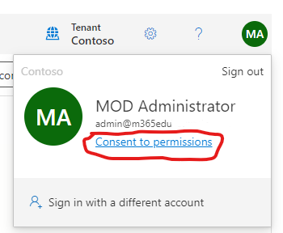

# Granting Site Permissions to App by SharePoint Admin

In order for the application to retrieve the documents from selected sites, you'll need to grant read permission. You'll first need to have the application Id from the app developer before moving forward. This process does not require yourself to run a separate/untrusted app and it limits the scope of the developer's application to only reading from the specified site. All you need to do is log in to a Microsoft site with your work microsoft credentials.

## Logging in

Go to https://developer.microsoft.com/en-us/graph/graph-explorer. You can click the person icon to the right and log in with your username/password or federated login.


## Grant Graph Explorer Permissions

The Graph Explorer tool requires permissions to run API queries and to read the sites. You'll need to click on your user icon, the click the link that says `Consent to permissions`. 



At a minimum, you'll need the following permissions that you can consent to as yourself:
- APIConnectors.Read.All
- APIConnectors.ReadWrite.All
- Sites.Manage.all (or Sites.FullControl.All)
- Sites.Read.all

## Retreiving Site Ids
In the text box, paste the string below, and replace the text `SITE_NAME` with the name of the SharePoint site. For example, if my site was called "PhysicalScience", the endpoint URL would look like `https://graph.microsoft.com/v1.0/sites?$select=id&$search=PhysicalScience`. Click `Run query`.

```text
https://graph.microsoft.com/v1.0/sites?$select=id&$search=SITE_NAME
```


It will respond with a simple payload that has the Id of the site you searched for. If an Id doesn't show, check the sitename. You'll need to use the value of Id without the quotes in the next step.

## Providing Site Read Permission to the App

In the textbox, paste the value below and replace `SITE_ID` with the value from the previous step (without quotation marks).

```text
https://graph.microsoft.com/v1.0/sites/SITE_ID/permissions
```

In the textarea field, paste in the JSON text below. You'll replace `APPLICAITON_ID` with the app Id that was provided to you by the developer.

```json
{
    "roles":[
        "read"
    ],
    "grantedToIdentities":[
        {
            "application":
            {
                "id":"APPLICATION_ID",
                "displayName":"sharepoint-doc-indexer"
            }
        }
    ]
}
```


That's it! You should have received a status code 201 response for it being created.
